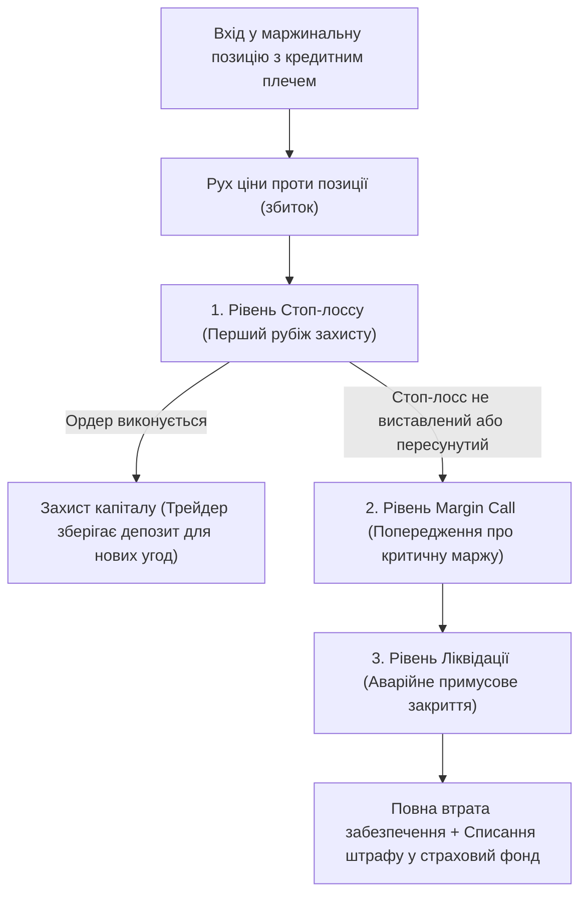

# Розділ 3. Ризик-менеджмент у високочастотній торгівлі

У високочастотному скальпінгу якісний ризик-менеджмент є єдиним фактором, що відділяє професійного трейдера від гравця в казино. Трейдинг — це математична гра ймовірностей, у якій головне завдання — збереження торгового капіталу в несприятливі періоди ринку.

---

## 1. Робочий об'єм позиції та маржинальні режими

Для довгострокового виживання на ринку скальпер повинен жорстко контролювати обсяг коштів, які задіюються в кожній окремій угоді.

### Контроль розміру позиції:
- **Правило обмеження об'єму**: робочий об'єм на одну угоду (маржа) не повинен перевищувати **10–20% від загального депозиту**.
- Вхід в угоду на весь депозит ("all-in" / "на всю котлету") категорично заборонений. Будь-який технічний патерн може бути миттєво зламаний непередбачуваною ринковою заявкою великого гравця.

### Маржинальні режими:
При торгівлі деривативами (ф'ючерсами) біржа пропонує два режими маржинального забезпечення:
1. **Ізольована маржа (Isolated Margin)**:
   - Ризик обмежений виключно тими коштами, які виділено на забезпечення конкретної позиції.
   - Якщо ціна піде проти вас, ліквідована буде лише маржа цієї конкретної угоди.
   - *Для скальпінгу цей режим є обов'язковим.*
2. **Кросс-маржа (Cross Margin)**:
   - Забезпеченням для всіх відкритих позицій виступає весь баланс торгового рахунку.
   - Якщо одна угода отримає критичний збиток, це може призвести до ліквідації всього депозиту.
   - *Використання кросс-маржі у високочастотній торгівлі є неприпустимим.*

---

## 2. Математика кредитного плеча (Leverage)

Серед початківців існує хибне переконання, що високе кредитне плече само по собі призводить до втрати депозиту. Насправді кредитне плече — це лише інструмент регулювання маржинальних вимог (забезпечення).

### Порівняльний аналіз ризику:
Припустимо, ваш депозит становить \$1000. Розглянемо два варіанти відкриття позиції на суму \$1000:

1. **Плече 1х (без плеча)**:
   - Ви купуєте актив на \$1000.
   - Біржа блокує на вашому рахунку \$1000 ваших особистих коштів як забезпечення.
   - Якщо ціна активу знизиться на 1%, ваш чистий збиток становитиме:
     $$\text{Loss} = \$1000 \times 0.01 = \$10$$
2. **Плече 100х**:
   - Ви купуєте актив на ту саму суму \$1000.
   - Біржа блокує лише \$10 вашого депозиту як забезпечення, решту (\$990) надає у вигляді кредитного забезпечення.
   - Якщо ціна активу знизиться на 1%, ваш збиток становитиме ті самі **\$10**.

**Висновок**: фінансовий результат (прибуток/збиток) залежить від загального номінального об'єму позиції, а не від розміру кредитного плеча.

> [!WARNING]
> Головна небезпека високого плеча полягає в тому, що воно дозволяє трейдеру відкрити позицію, яка суттєво перевищує його власний депозит (наприклад, позицію на \$100 000 при депозиті \$1000). У такому випадку рух ціни проти трейдера всього на 1% призведе до миттєвого повного знищення депозиту (ліквідації).

---

## 3. Математичне очікування та Risk/Reward (R:R)

Професійна торгівля будується на отриманні позитивного математичного очікування на серії угод. Трейдеру не потрібно бути правим у 100% випадків, щоб заробляти стабільний прибуток.

- **Співвідношення Ризик/Прибуток (Risk/Reward - R:R)**:
  Базове правило скальпінгу — середня величина прибутку повинна перевищувати середній збиток щонайменше у **3 рази** (R:R = 1:3). Ризикуючи \$10, потенційна ціль має принести \$30.
- **Математична матриця прибутковості**:
  При дотриманні R:R = 1:3 трейдер може мати відсоток успішних угод (Win Rate) на рівні всього **35-40%** і при цьому залишатися у стабільному плюсі.
  - *Приклад на 10 угодах (ризик \$10, тейк \$30)*:
    - 6 збиткових угод: $6 \times (-\$10) = -\$60$
    - 4 прибуткові угоди: $4 \times \$30 = +\$120$
    - Чистий результат (без комісій): $+\$60$
- **Профіт-фактор (Profit Factor)**:
  Статистичний показник ефективності, що розраховується як відношення суми всього прибутку до суми всіх збитків за період:
  $$\text{Profit Factor} = \frac{\sum \text{Прибуткові угоди}}{\sum \text{Збиткові угоди}}$$
  - Показник $> 1$ вказує на прибуткову торгівлю.
  - Оптимальний показник для скальпера лежить у діапазоні $1.5 - 2.5$.

---

## 4. Динамічні стопи та тейки

Швидкість ринку вимагає автоматизації виставлення захисних ордерів.

### Стоп-лосс (Stop-Loss / SL) як засіб виживання:
Стоп-лосс — це обов'язковий захисний ордер, який автоматично закриває збиткову позицію за заданою ціною.
- **Короткий стоп (Short Stop)**: у скальпінгу стоп вимірюється в пунктах (тіках) або сотих частках відсотка (типово 0.1%–0.3% від ціни входу).
- **Прив'язка до стакана**: захисний ордер ховають за великі лімітні щільності інших гравців. Трейдер розраховує, що поки ринок викуповуватиме великий об'єм стіни, позиція буде в безпеці. Якщо щільність розберуть, стоп-лосс виконається одразу за нею з мінімальними втратами.
- **Авто-стоп**: у торгових терміналах (наприклад, CScalp чи TigerTrade, див. `[[Розділ 1. Фундамент скальпера та механіка ринку]]`) налаштовується автоматичне виставлення стоп-лоссу сервером термінала миттєво після виконання ордера на вхід (наприклад, автоматичний стоп у 10 пунктів).

### Тейк-профіт (Take-Profit / TP):
Ордер на фіксацію прибутку.
- На відміну від інвесторів, скальпери не чекають великих цінових цілей. Фіксація прибутку відбувається лімітними ордерами в момент різкого імпульсу ціни (спрацювання стопів протилежної сторони).
- Використовується **часткова фіксація**: позиція закривається частинами (сходами) у міру розвитку імпульсу, що дозволяє максимізувати прибуток при сильних пробоях.

---

## 5. Стоп-лосс vs Ліквідація: порівняльний аналіз та співвідношення

У маржинальній торгівлі криптоактивами вкрай важливо чітко розрізняти два види закриття збиткових позицій: добровільно-контрольоване (Стоп-лосс) та примусове (Ліквідація). Вони відображають абсолютно різні підходи до ризику та захисту капіталу.

### 1. Визначення та порівняльна механіка

| Характеристика | Стоп-лосс (Stop-Loss / SL) | Ліквідація (Liquidation) |
| :--- | :--- | :--- |
| **Ініціатор процесу** | Трейдер (або автоматично налаштований ним алгоритм терміналу) | Біржа (автоматична система маржинального контролю ризиків) |
| **Природа закриття** | Добровільний, заздалегідь планований контроль ризику | Примусовий вихід з угоди через брак гарантійного забезпечення |
| **Фінансові втрати** | Невелика контрольована частина депозиту (наприклад, $0.1\%-0.5\%$ від позиції) | Втрата всієї виділеної маржі (Isolated) або всього балансу рахунку (Cross) |
| **Ціна виконання** | Встановлюється трейдером на основі структури ринку (за щільністю, за рівнем тощо) | Розраховується біржею автоматично на основі плеча та балансу рахунку |
| **Комісії та штрафи** | Звичайна торгова комісія за виконання ринкового ордера (Taker) | Додаткова штрафна комісія за ліквідацію у страховий фонд біржі |
| **Головна мета** | Збереження більшої частини капіталу для продовження торгівлі | Захист біржі від збитків, які перевищують баланс клієнта |

### 2. Співвідношення понять та багаторівнева система захисту

Співвідношення стоп-лоссу та ліквідації можна уявити як послідовні рівні захисту у системі ризик-менеджменту:

#### Вплив кредитного плеча на дистанцію ліквідації
Розмір кредитного плеча прямо визначає відстань від ціни входу до ціни ліквідації:
- **Низьке плече (наприклад, 2х–5х):** Дає значний простір для руху ціни проти позиції (20%–50% руху ціни до ліквідації).
- **Високе плече (наприклад, 50х–100х):** Наближає ціну ліквідації критично близько до входу (всього 1%–2% руху ціни).

У будь-якому випадку, стоп-лосс скальпера повинен виставлятися значно ближче (наприклад, на відстані 0.1%–0.3% або за найближчу технічну щільність у стакані) і ніколи не наближатися до ціни ліквідації.

> [!IMPORTANT]
> **Золоте правило скальпінгу:**
> Допущення ліквідації — це катастрофічна помилка ризик-менеджменту. Якщо ваша позиція ліквідовується, це означає, що ви або не виставили стоп-лосс, або критично завищили робочий об'єм. Трейдер, який регулярно допускає ліквідації, приречений на повне банкрутство, оскільки біржа закриває ліквідовані позиції за найгіршою ціною та стягує додатковий штраф.

---

## 6. Денні ліміти втрат та Тумблер дисципліни

Емоційне вигорання та втрата самоконтролю є головними причинами зливу депозитів.

- **Денний ліміт втрат (Максимальна просадка)**:
  Встановіть жорстке обмеження на сукупний денний збиток (наприклад, **3% від загального депозиту**).
- **Тумблер дисципліни**:
  Як тільки денний ліміт втрат вичерпано, ви зобов'язані закрити всі позиції, вимкнути торговий термінал і припинити торгівлю до наступного дня. Намагання негайно повернути втрачені кошти ("відбитися") вмикає стан тільту (див. `[[Розділ 5. Психологія та залізна дисципліна]]`), що гарантує повну втрату рахунку.
- Автоматизувати це правило можна за допомогою спеціальних ризик-менеджерів у проп-компаніях або налаштування лімітів у кабінетах статистики трейдера, які тимчасово блокують ключі API на торгівлю при досягненні ліміту.
